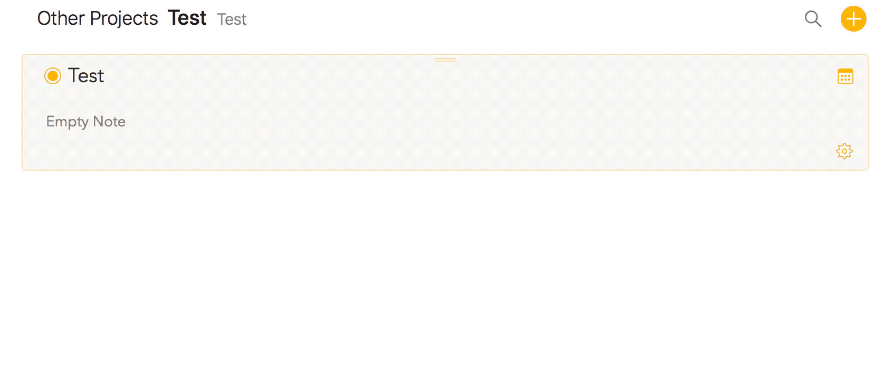

# AlfredWorkflow_YoudaoTranslate v1.10
alfred workflow，有道翻译

主要是按我的使用习惯做的，有什么建议欢迎提出。

## 一、功能介绍
#### 1.中英互译
#### 2.选中文字翻译
#### 3.发音
#### 4.记录查询历史
#### 5.添加单词到有道单词本
#### 6.多语言翻译

## 二、下载
[从github下载](https://github.com/Rouwanzi/AlfredWorkflow_YoudaoTranslate/blob/master/YoudaoDict.alfredworkflow)

## 三、使用说明
1.`Enter`复制该条目

2.`Cmd + Enter`直接打印该条目

3.双击`Ctrl`查询选中单词

4.`Shift + Enter`发音

5.`Option + Enter`去有道网页查看详细释义

6.`Ctrl + Enter`添加到有道单词本
使用前要添加有道账户用户名和密码到USER_NAME和PASSWORD。

7.输入`*`查看翻译历史，输入`*clear`清空翻译历史

8.使用有道智云翻译
添加有道智云的ID和key后即可使用

9.`#+语言代码`使用其他语种翻译

语言|代码
----|---
中文|zh-CHS
日文|ja
英文|EN
韩文|ko
法文|fr
俄文|ru
葡萄牙文|pt
西班牙文|es
越南文|vi

&nbsp;&nbsp;&nbsp;&nbsp;目前该功能只支持在提供有道智云账号的情况下使用。没有账号下，这个功能的开发投入和产出实在相差太大，并且后续维护也十分麻烦，基本没有后续开发的打算了。

## 四、Todo
- [X] 多语言翻译支持
- [ ] 自动更新机制
- [ ] 找一些好听的提示音添加
- [ ] 图标
- [ ] 围绕单词本的一些功能
- [ ] 解决一些发音的问题
- [ ] 单词本缓存，添加生词失败时，下次添加

## 五、 更新日志
v1.01  添加原始查询单词到下拉菜单第一行，方便复制  
V1.10  添加多语言翻译功能